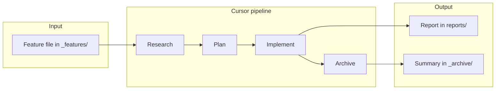

# Research Cursor

This repository is intended as a **"clean" Cursor project** which can be used to validate Cursor commands, agents, and workflows.

It enables the generation of **reports** (Markdown; may contain additional files within the reports directory) on new tools, libraries, ideas, and similar topics **without the agent being biased** by existing libraries, development patterns, or expectations.

Via this we aim to use the tool to **discover common usage patterns** that are not easily extracted from documentation and then **formalise them within the reports** for reuse in other projects.

---

## Executive summary

- **What this repo is**: A Cursor configuration–only project (agents, commands, rules, skills, workflows) with convention-based paths and **no application code**, so agents are not biased by existing codebases.
- **What it produces**: Reports in `reports/{report-name}/` and archived feature/bug summaries in `_archive/`, as defined in [.cursor/CONVENTIONS.md](.cursor/CONVENTIONS.md). The `docs/` folder is for Cursor workflow documentation and AI context only (see [docs/README.md](docs/README.md)).
- **Example**: The Typer CLI report ([reports/typer-cli-report/typer-cli-report.md](reports/typer-cli-report/typer-cli-report.md)) was produced via the feature pipeline as a documentation-only deliverable; its summary lives in [_archive/typer-cli-report/typer-cli-report.md](_archive/typer-cli-report/typer-cli-report.md).

---

## Installation

Clone the repository. There is no `install.sh`, `pyproject.toml`, or application runtime; no virtual environment or dependency setup is required. This is a configuration and documentation project, not a runnable application.

---

## Usage

Use **Cursor Composer** with the pipeline commands. Do not invoke individual workflow files directly.

| Command | Purpose |
|--------|--------|
| **`/feature-pipeline`** | Research → plan → implement → archive. Use with a feature file in `{features_dir}` (default: `_features`). For report generation: add a feature request describing the desired report (tools, libraries, ideas); the pipeline produces the report under `{reports_dir}/{report-name}/` and an archive summary under `_archive/`. |
| **`/bug-pipeline`** | Bug investigation and fixes (default: `_bugs`). |
| **`/update_context`** | (Re)generate AI context docs in `{context_docs_dir}` (default: `docs/AI_CONTEXT`). |

- **Path conventions**: Documented in [.cursor/CONVENTIONS.md](.cursor/CONVENTIONS.md). Override by documenting in this README or in `.cursor/rules`.
- **Cursor config details**: Agents, commands, rules, skills, and workflows are described in [.cursor/README.md](.cursor/README.md).

### Generating a report

1. Add a feature file under `_features/{name}.md` with **Background**, **This Task**, and **Testing Needed** (for a report, the deliverable is the document; testing may be "review only" or N/A).
2. Run **`/feature-pipeline`** in Composer with the feature name.
3. The report appears in `reports/{name}/`; a summary is written to `_archive/{name}/`.

---

## Structure

| Path | Purpose |
|------|--------|
| **`.cursor/`** | Agents, commands, rules, skills, workflows (generic; path placeholders in CONVENTIONS). |
| **`docs/`** | Cursor workflow documentation and AI context only (see [docs/README.md](docs/README.md)). `docs/AI_CONTEXT/` is used by `/update_context`. |
| **`reports/`** | Report outputs; one folder per report, e.g. `reports/typer-cli-report/`. Reports may exceed standard doc length and include multiple files. |
| **`_archive/`** | Completed feature/bug summaries (one summary per feature/bug per CONVENTIONS). |
| **`_features/`**, **`_bugs/`** | Default locations for feature requests and bug artifacts (created when used). |
