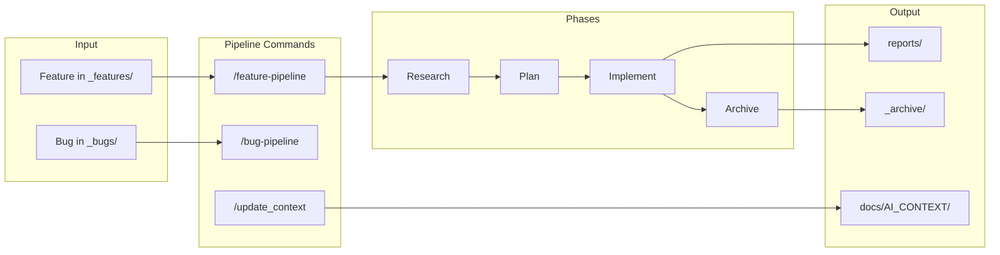

# AI Context Repository

- **Version:** 1
- **Last Updated:** 2026-02-13
- **Tags:** architecture, repository
- **Cross-References:** [AI_CONTEXT_QUICK_REFERENCE.md](AI_CONTEXT_QUICK_REFERENCE.md) | [AI_CONTEXT_PATTERNS.md](AI_CONTEXT_PATTERNS.md) | [AI_CONTEXT_CURSOR_CONFIG.md](AI_CONTEXT_CURSOR_CONFIG.md)

---

## High-Level Overview

This repository is a **Cursor configuration–only** project: no application source or tests. Its goal is to validate Cursor commands, agents, and workflows and to produce **reports** (Markdown, under `reports/`) and **archived summaries** (under `_archive/`) without biasing agents with existing codebases.

Main structural elements: **`.cursor/`** (agents, commands, rules, skills, workflows); **`docs/`** (workflow documentation and AI context); **`reports/`** and **`_archive/`** (outputs); **`_features/`** and **`_bugs/`** (inputs when used).

---

## Directory Structure

```
research_cursor/
├── .cursor/                    # Cursor config (agents, commands, rules, skills, workflows)
│   ├── agents/                  # Personas (research, plan, implement, debug, archivist, ai-context-writer, etc.)
│   ├── commands/                # Orchestrator commands (feature-pipeline, bug-pipeline, update_context, commit, etc.)
│   ├── rules/                   # Project rules (environment, development_practices, documentation, content_length)
│   ├── skills/                  # ai-context-* skills for context docs
│   ├── workflows/               # Phase workflows invoked by pipeline commands
│   ├── CONVENTIONS.md           # Path placeholders and folder roles
│   ├── README.md                # Cursor config overview
│   └── scratchpad.md            # Handoff for pipeline phases
├── docs/                        # Cursor workflow docs and AI context only
│   ├── AI_CONTEXT/              # Generated AI context (quick reference, repository, patterns, per-component)
│   └── README.md                # Purpose of docs/
├── reports/                     # Report outputs; one folder per report (may exceed doc length)
├── _archive/                    # Completed feature/bug summaries
├── _features/                   # Feature request docs (default; created when used)
├── _bugs/                       # Bug artifacts (default; created when used)
└── README.md                    # Project summary, installation, usage
```

---

## Component Responsibilities

| Component | Responsibility |
|-----------|-----------------|
| **`.cursor/`** | Defines agents, commands, rules, skills, and workflows; CONVENTIONS.md defines path placeholders; scratchpad used for phase handoff. |
| **`docs/`** | Holds Cursor workflow documentation and `docs/AI_CONTEXT/` for generated context; reports do **not** go here. |
| **`reports/`** | One folder per report; content may exceed standard doc length. |
| **`_archive/`** | One summary per completed feature/bug per CONVENTIONS. |
| **`_features/`**, **`_bugs/`** | Input locations for feature requests and bug artifacts (convention defaults). |

---

## Data Flow



- **Feature flow:** Feature file → research → plan → implement (report) → archive (summary).
- **Context flow:** `/update_context` → reads project and rules → writes quick reference, repository, patterns, per-component docs into `docs/AI_CONTEXT/`.

---

## Service/Module Boundaries & Dependencies

- **No application code or external runtime dependencies.** Boundaries are between Cursor config units: commands orchestrate workflows; workflows reference agents and conventions; rules apply globally. Skills are used by the ai-context-writer when generating context docs.
- **External:** Cursor IDE and Composer; no package manager or language runtime required.

---

## Entry Points & Extension Hooks

- **Entry:** Run pipeline commands in Cursor Composer (`/feature-pipeline`, `/bug-pipeline`, `/update_context`). Do not invoke workflow files directly.
- **Extension:** Add agents in `.cursor/agents/`, commands in `.cursor/commands/`, workflows in `.cursor/workflows/`, rules in `.cursor/rules/`, skills in `.cursor/skills/`. Override path defaults in README or `.cursor/rules` per CONVENTIONS.md.
