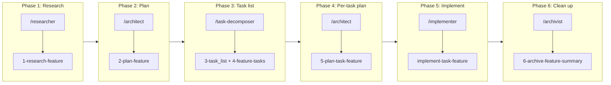
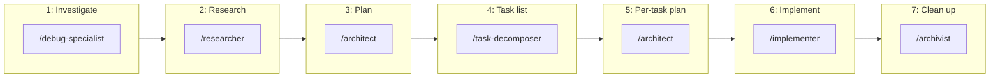
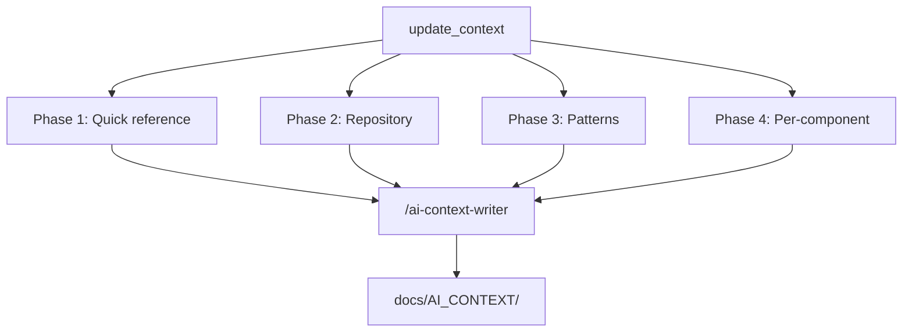

# Cursor System Documentation

Documentation for the `.cursor` configuration: orchestrators (commands), agents, skills, workflows, and rules. The audience is developers experienced with Cursor and LLM/agent-assisted development.

**Authoritative sources** live under `.cursor/`; this folder is supplementary documentation. Path placeholders are defined in [CONVENTIONS.md](../../.cursor/CONVENTIONS.md).

---

## 1. System Overview

The system provides **orchestrated multi-phase pipelines** for features and bugs, plus a separate **AI context documentation** pipeline. Orchestrator commands run in Composer and invoke **subagents** (`/researcher`, `/architect`, etc.) in sequence; handoff between phases uses a shared **scratchpad** (`.cursor/scratchpad.md`).

```
┌─────────────────────────────────────────────────────────────────────────────┐
│                         CURSOR SYSTEM (.cursor)                             │
├─────────────────────────────────────────────────────────────────────────────┤
│  ORCHESTRATORS (commands/)     →  Invoke agents + workflows in sequence     │
│  AGENTS (agents/)               →  Personas with defined workflows          │
│  WORKFLOWS (workflows/)         →  Phase-specific steps (do not run alone)  │
│  SKILLS (skills/)               →  Used by ai-context-writer per doc type   │
│  RULES (rules/)                 →  Always / conditionally applied           │
│  CONVENTIONS (CONVENTIONS.md)   →  Path placeholders, folder roles          │
└─────────────────────────────────────────────────────────────────────────────┘
```

---

## 2. High-Level Flows

### 2.1 Feature pipeline (primary)

User runs **feature-pipeline** with a feature name; orchestrator runs phases 1–6, pausing for **user approval after Phase 2 (Plan)** before generating tasks.



Artifacts live under `{features_dir}/{feature_name}/` (default `_features/{feature_name}/`). After Phase 6, the archivist writes one summary to `{archive_dir}/{feature_name}/` and the pipeline deletes the feature folder and request file.

### 2.2 Bug pipeline (valuable; not code-dependent)

The **bug-pipeline** mirrors the feature pipeline with an extra investigation phase and different paths (`{bugs_dir}`, `{archive_dir}/fix-{bug_name}/`). It is **not strictly dependent on having application code**: it is valuable for structured bug investigation, research, planning, and archival even in documentation-only or research repositories. When there is no test suite, the pipeline’s regression gate (run tests before commit) is effectively a no-op until tests exist.



### 2.3 AI context (update_context)

The **update_context** command orchestrates the **ai-context-writer** subagent once per document type (and once per component for component docs). It does **not** run the feature or bug pipeline.



---

## 3. Path Conventions (summary)

| Placeholder          | Purpose                          | Default        |
|----------------------|----------------------------------|----------------|
| `{features_dir}`     | Feature requests + planning      | `_features`     |
| `{bugs_dir}`         | Bug investigation + fix artifacts| `_bugs`        |
| `{archive_dir}`      | Completed feature/bug summaries  | `_archive`     |
| `{reports_dir}`      | Long-form reports (output only)  | `reports`      |
| `{context_docs_dir}` | AI context output                | `docs/AI_CONTEXT` |
| `{scratchpad}`       | Pipeline handoff file            | `.cursor/scratchpad.md` |

Override by documenting in project README or `.cursor/rules`. **Do not use `reports/` as input** to any pipeline phase unless the user explicitly provides content from there.

---

## 4. Document Index

| Document              | Contents |
|-----------------------|----------|
| [ORCHESTRATORS.md](ORCHESTRATORS.md) | Commands: feature-pipeline, bug-pipeline, update_context, commit, content_length; commit procedure; resume behaviour. |
| [AGENTS.md](AGENTS.md)               | All agents: roles, workflows they run, output/handoff. |
| [WORKFLOWS.md](WORKFLOWS.md)         | Workflows by pipeline phase; feature vs bug; implement vs plan. |
| [SKILLS_AND_RULES.md](SKILLS_AND_RULES.md) | Skills for ai-context-writer; project rules (.mdc). |

---

## 5. Quick Reference: What to Run Where

- **Implement a feature from a spec** → Use **feature-pipeline** (Composer). Provide feature name or path; ensure `{features_dir}/{feature_name}.md` exists with Background, This Task, Testing Needed.
- **Fix a bug with structured investigation** → Use **bug-pipeline** (Composer). Provide bug name; pipeline creates investigation/research/plan/task structure.
- **Refresh AI context docs** → Use **update_context** (Composer). Writes/updates files in `docs/AI_CONTEXT/`.
- **Commit after a phase or task** → Follow the **Commit Procedure** in feature-pipeline (or bug-pipeline); or run **commit** command for a suggested Conventional Commits message only (no `git commit`).
- **Check file length** → Use **content_length** command with a file or folder; applies rules from `content_length.mdc`.

Do **not** invoke workflow files (e.g. `1-research-feature.md`) directly; always use the orchestrator commands so that phases, scratchpad, and commits stay consistent.
