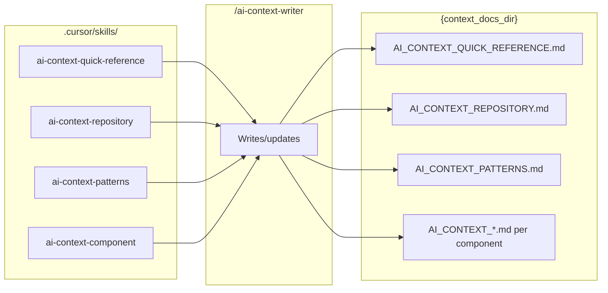

# Skills and Rules

Skills drive the **ai-context-writer** for each AI context document type. Rules (`.mdc`) are applied by Cursor to all agents; some are always applied, others are conditional (e.g. by glob).

---

## 1. Skills (ai-context-writer)

Skills live in `.cursor/skills/`. The **update_context** orchestrator invokes `/ai-context-writer` once per document type (and once per component), passing the corresponding skill. The writer reads the skill and produces or updates the target file in `{context_docs_dir}` (default `docs/AI_CONTEXT/`).

| Skill | Target document | Purpose |
|-------|------------------|---------|
| **ai-context-quick-reference** | `AI_CONTEXT_QUICK_REFERENCE.md` | Cheat sheet: environment, commands, entry points, troubleshooting. Short and scannable. |
| **ai-context-repository** | `AI_CONTEXT_REPOSITORY.md` | Architecture: directory structure, component responsibilities, data flow (mermaid), entry points. |
| **ai-context-patterns** | `AI_CONTEXT_PATTERNS.md` | Patterns: code organization, typing, error handling, testing, validation; Q&A style. |
| **ai-context-component** | `AI_CONTEXT_{COMPONENT_NAME}.md` | Per-component: overview, public interfaces, lifecycle, extension points, examples. Orchestrator passes component name and path. |

All output must include **metadata** (version, last updated, tags, cross-references) and respect **content length** (see Rules below). Sources to read are defined inside each skill under `.cursor/skills/ai-context-*/SKILL.md`.

---

## 2. Skills Diagram

---

## 3. Project Rules (.cursor/rules/)

Rules are MDC files that Cursor applies during conversations. Paths below are relative to the repo root.

| Rule | alwaysApply | Scope | Summary |
|------|-------------|--------|---------|
| **development_practices.mdc** | true | All | TDD; models for complex data; DI for non-deterministic deps; validation via models; black-box tests; working/valid tests; regression gate. |
| **environment.mdc** | true | All | Tooling (pyproject.toml, package.json, README); venv/install.sh; structure (docs, features_dir, bugs_dir, .cursor); Git; lint/style; test suite. |
| **documentation.mdc** | true | All | Obey content_length; concise docs; Google Docstrings; README requirements; docs in docs/ or root; reports in reports/; doc reflects code, not vice versa. |
| **content_length.mdc** | false | `*.md`, `*.py` | Max 500 lines per doc/code file; split with index for docs; convert to module for long code; exception for reports/. |

---

## 4. Rule Details (summary)

### 4.1 development_practices.mdc

- **TDD**: Write test first.
- **Models**: Use data classes/models for complex or nested data.
- **Dependency injection**: Non-deterministic systems (e.g. time, external clients) passed as parameters.
- **Validation**: Ingest via model; if validation fails, do not use; once valid, do not re-check.
- **Black box testing**: Validate behaviour, not internals (no "called_once", no log-line checks); mock clients for external data; validate returned/referenced objects; use expect-exception tests for exceptions.
- **Working tests**: Fix broken tests.
- **Valid tests**: Tests must be able to fail.
- **Regression gate**: Any failure not marked as expected is a regression and must be fixed before task complete.

### 4.2 environment.mdc

- Use project-defined tooling and versions; create `install.sh` if missing (venv, install deps, run tests).
- Activate runtime environment when running project commands.
- Add new dependencies to project dependency file and run install script; no ad hoc pip/npm install.
- Structure from README or CONVENTIONS.md; use path placeholders for features_dir, bugs_dir, etc.
- Git: use project wrapper for commit if provided; else `git commit` directly.
- Use project test runner and linters; resolve style/type issues; all tests must pass (excluding expected failures).

### 4.3 documentation.mdc

- Follow content_length.mdc.
- Concise code and project docs; Google Docstrings for functions.
- README: executive summary, installation, usage.
- Extra docs in docs/ or root; docs/ also for Cursor workflow and AI context; reports in reports/.
- Refresh understanding before and after writing; never change code to match docs—update docs to match code.

### 4.4 content_length.mdc (agent_requestable / glob)

- **Docs (Markdown)**: Max 500 lines; if longer, split into logical subfiles in a folder + index.md; exception for `reports/`.
- **Code (Python)**: Max 500 lines; if longer, convert to module (folder, `__init__.py`, split files, models in `models/` or shared location; internal-only in subfolder).

The **content_length** command applies this rule to a given file or folder (or discovers markdown/code files if none given).
