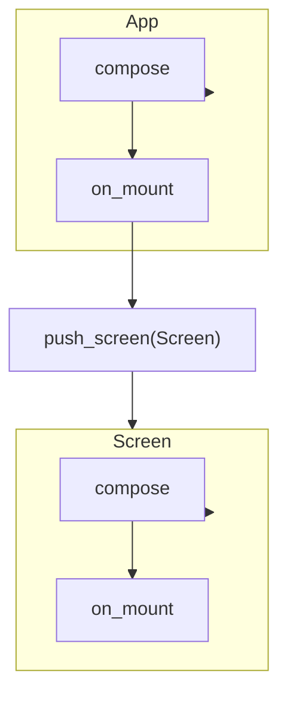

# 01 — Patterns and structure

This document describes **standardised patterns** for Textual apps: App and Screen structure, composition, widgets, lifecycle, and modern Python 3 style so teams can adopt Textual consistently.

## Requirements

- **Python**: 3.9 or later (Textual requirement).
- **Install**: `pip install textual`.

References: [Textual Guide](https://textual.textualize.io/guide/), [API](https://textual.textualize.io/api/), [Screens](https://textual.textualize.io/guide/screens/).

---

## App as entry point

The **App** is the root. Subclass `textual.app.App` and override `compose()` to declare the initial widget tree. Use type hints and, for forward references, `from __future__ import annotations`.

```python
from __future__ import annotations

from textual.app import App, ComposeResult
from textual.widgets import Static


class MyApp(App[None]):
    """Minimal Textual app with a single widget."""

    def compose(self) -> ComposeResult:
        yield Static("Hello, Textual.")
```

- `App[None]`: generic indicates the type of the "return" value when the app exits (e.g. `App[str]` if you exit with a string result).
- `compose()` **yields** widgets; they are added to the default screen automatically.

---

## Compose and widgets

- **`compose()`**: Declarative: yield widgets in the order they should appear. Textual adds them to the (default or current) screen.
- **Containers**: Use `Vertical`, `Horizontal`, `VerticalScroll`, etc. to lay out children.
- **IDs**: Give widgets `id="..."` so you can query them with `self.query_one("#id", WidgetType)`.

```python
from __future__ import annotations

from textual.app import App, ComposeResult
from textual.containers import VerticalScroll
from textual.widgets import Header, Static


class StructuredApp(App[None]):
    def compose(self) -> ComposeResult:
        yield Header()
        with VerticalScroll():
            yield Static("Content", id="main")
```

---

## Screens

A **Screen** is a full-size container; only one is active at a time. The app has an implicit default screen; you can define custom screens and push/pop them.

```python
from __future__ import annotations

from textual.app import App, ComposeResult
from textual.screen import Screen
from textual.widgets import Static


class MainScreen(Screen[None]):
    def compose(self) -> ComposeResult:
        yield Static("Main screen", id="main")


class MultiScreenApp(App[None]):
    def on_mount(self) -> None:
        self.push_screen(MainScreen())

    def compose(self) -> ComposeResult:
        return  # Initial UI can be empty; MainScreen provides content
```

- **`push_screen(Screen)`**: Puts the screen on the stack and makes it active.
- **`pop_screen()`**: Removes the current screen and returns to the previous one.
- **`Screen[T]`**: Generic `T` is the type of the value returned when the screen is dismissed (e.g. via `dismiss(result)`).

---

## Lifecycle

Typical order: **compose** (widgets created) → **mount** (screen/widget attached) → **message handlers** (events).

| Hook | When it runs |
|------|-------------------------------|
| `compose()` | When the app or screen is composed; yields widgets. |
| `on_mount()` | When the app or a widget is mounted (attached to the tree). Use for one-off setup, focus, workers. |
| `on_unmount()` | When the app or widget is removed from the tree. Use for cleanup. |

Prefer **`on_mount()`** for initialising state and setting focus; avoid heavy work on the main loop—use **workers** for I/O or CPU-heavy work.

```python
from textual.widgets import Input

def on_mount(self) -> None:
    self.query_one("#input", Input).focus()
```

---

## App / screen flow (diagram)



---

## Modern Python 3 style

- **Type hints**: Annotate `compose() -> ComposeResult`, `on_mount(self) -> None`, and method parameters.
- **`from __future__ import annotations`**: Allows forward references and keeps annotations as strings when needed.
- **Generators**: `compose()` yields widgets; use `yield` and, if needed, `with Container():` then `yield` inside.

```python
from __future__ import annotations

from textual.app import App, ComposeResult
from textual.widgets import Static


class TypedApp(App[None]):
    def compose(self) -> ComposeResult:
        yield Static("Typed and structured.")
```

---

## Run the app

```python
if __name__ == "__main__":
    app = MyApp()
    app.run()
```

Use `app.run()` for normal run; the app runs until it exits (e.g. Quit command or `exit()`).

---

## Summary

| Concept | Practice |
|--------|----------|
| Entry point | Subclass `App[T]`; implement `compose()`. |
| Layout | Yield widgets in `compose()`; use containers for structure; use `id` for querying. |
| Screens | Subclass `Screen[T]`; use `push_screen` / `pop_screen` for navigation. |
| Lifecycle | Use `on_mount()` for setup and focus; `on_unmount()` for cleanup. |
| Style | Type hints, `from __future__ import annotations`, and clear method signatures. |

Next: [02-commands-and-dynamic-options.md](02-commands-and-dynamic-options.md) for system commands and command providers.
