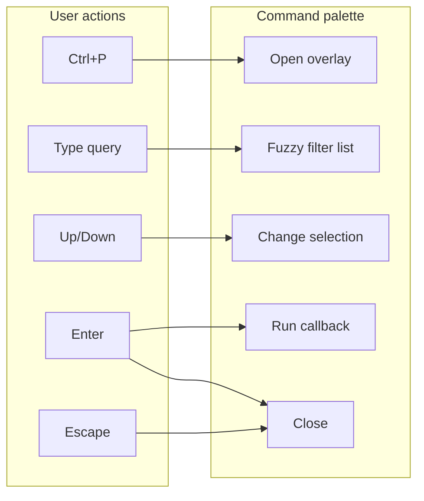
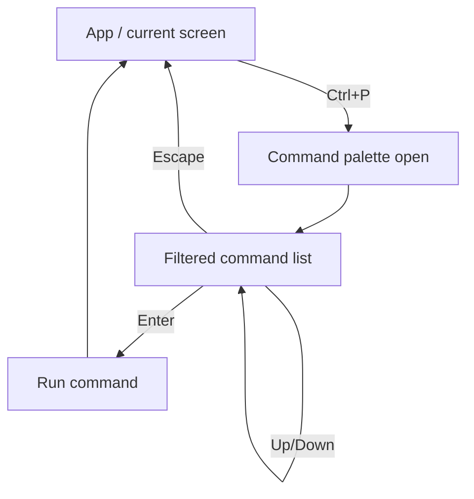

# 03 — Menus and traversal

This document covers **using** the command palette (launch, search, traversal), **screen-specific** commands, and how to **disable** or **rebind** the palette. It also outlines menu-handling and navigation patterns.

References: [Command palette](https://textual.textualize.io/guide/command_palette/), [Screens](https://textual.textualize.io/guide/screens/).

---

## Launching the command palette

By default the command palette is opened with **Ctrl+P**. The palette is a full-screen overlay with:

- A **search input** at the top.
- A **list of commands** that filter as the user types (fuzzy match).
- **Up / Down** to move selection; **Enter** to run the selected command; **Escape** to close without running.



---

## Traversal (keyboard)

| Key | Action |
|-----|--------|
| **Ctrl+P** | Open command palette (default binding). |
| **Up / Down** | Move selection in the command list. |
| **Enter** | Run the selected command and close the palette. |
| **Escape** | Close the palette without running a command. |

Typing in the search box updates the list in real time; matching is **fuzzy** (e.g. "ch" matches "**Ch**ange theme", "th" matches "Change **th**eme").

---

## Screen-specific commands

Commands can be **scoped to a screen**. Add a `COMMANDS` class variable on a **Screen** subclass; those providers (and their commands) are only considered when that screen is active. The **screen** passed to `get_system_commands(screen)` is the active screen, so you can also tailor system commands by `screen` type.

Example: only show "Save" when the Editor screen is active.

```python
from textual.app import App, ComposeResult
from textual.screen import Screen
from textual.widgets import Static


class EditorScreen(Screen[None]):
    def compose(self):
        yield Static("Editor", id="editor")
```

Register a provider on `EditorScreen` via `COMMANDS = {SaveCommandProvider}` so "Save" appears only when the user has pushed `EditorScreen`. App-level `get_system_commands(screen)` can likewise check `type(screen) is EditorScreen` and yield a "Save" system command only then.

---

## Disabling the command palette

To disable the palette entirely, set on your **App** class:

```python
class NoPaletteApp(App[None]):
    ENABLE_COMMAND_PALETTE = False
```

The Ctrl+P binding will do nothing and the palette will not be available.

---

## Changing the palette key

To use a different key (e.g. the older Textual binding), set **COMMAND_PALETTE_BINDING** on your App:

```python
class CustomBindingApp(App[None]):
    COMMAND_PALETTE_BINDING = "ctrl+backslash"
```

Use the same key format as for [BINDINGS](https://textual.textualize.io/api/binding/) (e.g. `"ctrl+p"`, `"f1"`).

---

## Menu handling patterns

- **Single global palette**: Rely on the built-in palette (Ctrl+P) and add commands via `get_system_commands()` and/or `COMMANDS` providers. No extra "menu" widget required.
- **Screen-specific commands**: Attach providers or system-command logic to the active screen so commands are context-aware.
- **Nested navigation**: Use **screens** for big steps (e.g. Main → Settings → Back). Use the **palette** for one-off actions (Quit, Theme, Open file). Use **key bindings** for very frequent actions (e.g. `q` to quit).

Traversal between screens is done in code (e.g. `push_screen(SettingsScreen())`, `pop_screen()`), not by the palette; the palette is for **commands**, not screen stack navigation.

---

## Traversal flow (high level)



---

## Summary

| Topic | Practice |
|-------|----------|
| Open palette | Ctrl+P (or `COMMAND_PALETTE_BINDING`). |
| Traversal | Up/Down to move, Enter to run, Escape to close. |
| Search | Fuzzy; type to filter the list. |
| Screen commands | Add `COMMANDS` or system-command logic per Screen. |
| Disable palette | `ENABLE_COMMAND_PALETTE = False`. |
| Rebind key | `COMMAND_PALETTE_BINDING = "ctrl+backslash"` (or other key). |

Next: [04-exit-and-shutdown.md](04-exit-and-shutdown.md) for quitting and shutdown behaviour.
