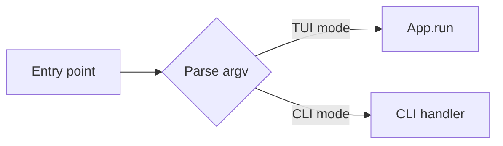

# 06 — Adding a CLI to an existing Textual TUI

This document gives **established advice** on adding a command-line interface to an existing Textual TUI project: when it makes sense, how to structure entry points and shared logic, and how to keep behaviour consistent. Use it when your app is **TUI-first** and you want a CLI for scripting, CI, headless runs, or non-interactive use.

---

## Should you add a CLI?

| Situation | Recommendation |
|-----------|-----------------|
| **TUI-only tool** | No CLI required; optional CLI args (e.g. `--help` or `--version`) only if needed. |
| **TUI and you want scripting/CI/headless** | Add a CLI so one codebase serves both: CLI for scripts and automation, TUI for interactive use. |
| **TUI and CLI with different behaviour by design** | Keep one entry point that branches (e.g. `--tui` vs default CLI), or two entry points; share **logic** and document differences. |

**Add a CLI** when you want one codebase, one set of options where possible, and consistent behaviour between interactive (TUI) and non-interactive (CLI) use. **Don’t add a CLI** when the TUI is the only interface you need; then optional flags are enough.

---

## Entry-point and structure

Use a **single entry point** (e.g. `__main__.py` or a `console_scripts` entry point) that inspects `sys.argv` (or parses with argparse/Click/Typer) and either runs the CLI or launches the Textual app. Run the TUI with `python -m my_tool` (or `python my_tool/__main__.py`) so that `sys.argv` is available; avoid relying on `textual run` if you need to pass arguments into your app.

**Suggested layout:**

```text
my_tool/
  __main__.py     # Dispatches to cli.run() or tui.run() based on argv
  cli.py          # argparse/click/typer for CLI-only path
  tui/
    app.py        # Textual App
  core/
    config.py     # Shared
    service.py    # Shared
```

Flow: entry point parses args → if “run TUI” (e.g. `--tui` or no CLI subcommand), instantiate `App` and call `app.run()`; otherwise run the CLI handler.



---

## Shared logic

Put **core behaviour** (validation, config, business logic) in a **library layer** (e.g. `core/`). Both the CLI and the TUI call into this layer; neither should duplicate logic. The library should **raise** on errors; the **CLI** is responsible for catching exceptions, printing messages, and calling `sys.exit(code)`; the **TUI** may show errors in the UI. Do not branch on “am I CLI or TUI?” inside the core; keep the core UI-agnostic.

---

## CLI stack

Choose one of **argparse** (stdlib), **Click**, or **Typer** for the CLI path only. The same trade-offs as in [05 — CLI integration](05-cli-integration.md) apply: argparse is stdlib and familiar; Click and Typer offer richer option handling and nesting. **Trogon** and **argparse-tui** are for the opposite direction (CLI → TUI); they do not help when you are adding a CLI to an existing TUI. Use your chosen CLI library only in the CLI entry point (e.g. `cli.py`); the TUI continues to use Textual’s `App` and widgets.

---

## Behavioural consistency

Where the CLI and TUI do the **same operation** (e.g. “run job X”, “export config”), use the **same core functions** and the same semantics (options, defaults) so behaviour stays consistent. **Document** where they differ: for example, the CLI might support machine-readable output (e.g. `--json`) or non-interactive defaults, while the TUI might offer interactive prompts or extra screens. List these differences in your docs or in the report so users know what to expect from each interface.

---

## Quick reference

| Entry point | CLI stack | Behavioural consistency |
|-------------|-----------|--------------------------|
| Single script (e.g. `__main__.py`) that branches on argv | argparse / Click / Typer | Shared core logic; CLI handles exit and output; document differences. |
| Two scripts (one CLI, one TUI) | Same as above in CLI script | Same as above; document when each is used. |

---

## Summary

- **Add a CLI** when you have a TUI-first app and need scripting, CI, or headless use: use a single entry point that branches on argv, or two entry points that share core logic.
- **Structure:** Entry point → parse argv → run CLI or `App.run()`; keep core in a library; CLI handles exceptions and `sys.exit()`.
- **CLI stack:** argparse, Click, or Typer for the CLI path only; Trogon/argparse-tui are for CLI→TUI, not TUI→CLI.
- **Consistency:** Same semantics for shared operations; document where CLI and TUI differ.

---

See also: [05 — CLI integration](05-cli-integration.md) (adding a TUI to an existing CLI).

[Back to index](index.md)
