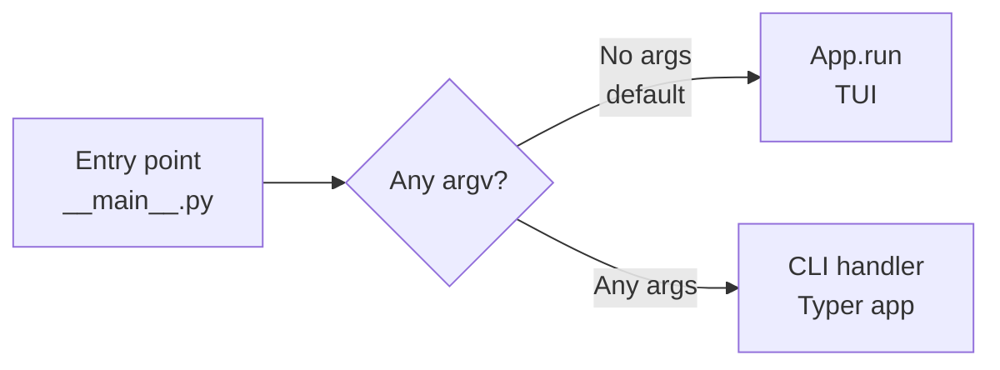

# 01 — Entry point and structure

This document establishes **when** to add a TUI and CLI to a library project and the **recommended structure**: a single entry point that dispatches to a Typer CLI or a Textual TUI, with a shared core layer. Use this pattern when you want one codebase for both interactive (TUI) and non-interactive (CLI) use.

---

## When to add a TUI and CLI

| Situation | Recommendation |
|-----------|----------------|
| **Library with no UI** | Add both when you want: a TUI for interactive use and a CLI for scripting, CI, or headless runs. |
| **TUI-only tool** | Add a CLI when you need scripting/CI/headless; one entry point serves both. |
| **CLI-only tool** | Add a TUI when you want an interactive mode; same entry point can branch (e.g. `--tui`). |
| **Different behaviour by design** | Use one entry point that branches, or two entry points; share **logic** and document differences. |

**Use this pattern** when you want one codebase, one set of options where possible, and consistent behaviour between TUI and CLI. **Don’t** add both if you only need one interface; then optional flags (e.g. `--help`) are enough.

---

## Single entry point

Use a **single entry point** (e.g. `__main__.py` or a `console_scripts` entry point) that parses `sys.argv` (with Typer, Click, or argparse) and either runs the CLI or launches the Textual app. Run the TUI via `python -m my_tool` (or `python my_tool/__main__.py`) so that `sys.argv` is available; avoid relying on `textual run` if you need to pass arguments into your app.

**Dispatch rule:** **TUI is the default when no arguments are passed** (i.e. when `sys.argv` has no elements after the script name). When the user passes any arguments (e.g. a subcommand, `--help`, or options), run the CLI handler (Typer app). Optionally, also treat an explicit `--tui` (or `-t`) as TUI so that `my_tool --tui` launches the TUI even though it has an arg.

---

## Package layout

Suggested layout for a library that offers both TUI and CLI:

```text
my_tool/
  __main__.py     # Dispatches to cli.run() or tui.run() based on argv
  cli.py          # Typer app for CLI-only path
  tui/
    __init__.py
    app.py        # Textual App
  core/
    __init__.py
    config.py     # Shared config, validation
    service.py    # Shared business logic
```

- **`__main__.py`**: Parses argv; calls CLI or TUI entry; does not contain business logic.
- **`cli.py`**: Typer app and commands; calls into `core/` for behaviour.
- **`tui/app.py`**: Textual `App`; calls into `core/` for behaviour.
- **`core/`**: Config, validation, and business logic; UI-agnostic; no imports from `cli` or `tui`.

---

## Dispatch flow



Flow: entry point parses argv → if **no arguments** (empty after script name), run the TUI (`App.run()`); otherwise run the CLI handler (e.g. `cli.app()`). So `my_tool` with no args launches the TUI; `my_tool --help` or `my_tool run job1` runs the CLI.

---

## Code example: entry point and layout

**`__main__.py`** — dispatch only: TUI when no args (default), CLI when any args:

```python
"""Entry point: dispatch to CLI or TUI based on argv."""
from __future__ import annotations

import sys


def main() -> None:
    # No arguments (after script name) → TUI (default). Any arguments → CLI.
    args = sys.argv[1:]
    if len(args) == 0:
        from my_tool.tui.app import MyApp
        app = MyApp()
        app.run()
    else:
        from my_tool.cli import run_cli
        run_cli()
```

**Optional:** Treat explicit `--tui` or `-t` as TUI even when other args exist (e.g. `my_tool --tui`), by checking for that flag before the `len(args) == 0` check; otherwise, “no args” alone is enough for the default.

**Alternative:** Use Typer (or Click) in `__main__.py` to parse args and then either call the Typer app for CLI subcommands or launch the TUI when no subcommand/args are given; both approaches keep a single entry point.

**Layout (ASCII):**

```text
my_tool/
  __main__.py   → parse argv → TUI (App.run) or CLI (Typer)
  cli.py        → Typer app; calls core
  tui/app.py    → Textual App; calls core
  core/         → config, service; no UI
```

---

## Two entry points (alternative)

If you prefer **two** entry points (e.g. `my-tool` for CLI and `my-tool-tui` for TUI), keep the same layout but expose two scripts (e.g. via `console_scripts` in `pyproject.toml`). Both scripts must call into the same **core**; document when to use each and any behavioural differences.

---

## Summary

- **When:** Add TUI and CLI when you want one codebase for interactive and non-interactive use; use a single entry point that branches on argv.
- **Structure:** `__main__.py` dispatches; `cli.py` (Typer) and `tui/app.py` (Textual) call into `core/`; core is UI-agnostic.
- **Flow:** Entry point → **no args → TUI (default)**; any args → CLI (Typer handler). Root CLI help should note that running with **no** arguments launches the TUI.

See also: [02 — Shared core](02-shared-core.md) | [03 — CLI (Typer)](03-cli-typer.md) | [04 — TUI (Textual)](04-tui-textual.md) | [Index](index.md)
