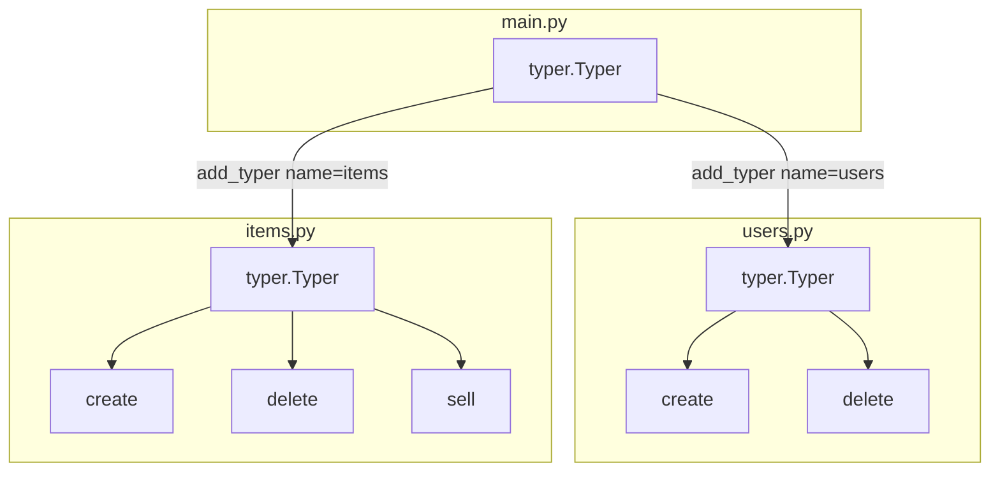

# Python Typer CLI Report

Standardised patterns for building CLIs with the Python Typer library, aligned with Typer and Python 3 principles. Covers dynamic command addition, command-centric help, and parameter requirements.

---

## Introduction

**Typer** is a Python library for building command-line interfaces. It uses **type hints** to declare arguments and options, is built on **Click**, and is designed so that CLIs are easy to write and maintain. Typer applications are **composable**: you can combine multiple `typer.Typer()` apps into a single CLI with nested command groups. **Automatic help** is generated from function signatures and docstrings, and shell completion is supported.

**Core principles:**

- **Type hints**: Parameters are declared with standard Python types (and optionally `typer.Argument` / `typer.Option`). Typer infers CLI arguments and options from them.
- **Click underneath**: Typer wraps Click; you get Click's behaviour with a type-hint-first API.
- **Composability**: Each `typer.Typer()` instance can be used alone or added to another via `add_typer()`, so you can grow from a single script to a multi-command, multi-module CLI.
- **Automatic help**: Docstrings and `help=` on parameters and commands drive `--help` output without extra boilerplate.

**When to use Typer:** Prefer Typer when you want a modern, type-hint-based CLI with subcommands and good defaults (help, validation, completion). For very small one-off scripts, `argparse` or a single `typer.run(main)` may be enough; for full control over Click's API, use Click directly.

---

## Minimal app

Two minimal patterns: a single function with `typer.run()`, or an explicit `typer.Typer()` app.

**Pattern 1: Single function and `typer.run()`**

```python
import typer

def main(name: str) -> None:
    print(f"Hello {name}")

if __name__ == "__main__":
    typer.run(main)
```

Typer builds a CLI from `main`'s signature. Running without arguments triggers a missing-argument error; `--help` is generated automatically.

**Pattern 2: Explicit Typer app and one command**

```python
import typer

app = typer.Typer()

@app.command()
def main(name: str) -> None:
    print(f"Hello {name}")

if __name__ == "__main__":
    app()
```

**Example invocations:**

```text
$ python main.py --help
Usage: main.py [OPTIONS] NAME
  ...
$ python main.py Camila
Hello Camila
```

Use Python 3.9+ and type hints in both patterns.

---

## Commands

Register multiple commands on one app with `@app.command()`. The function **docstring** becomes the short description shown in the main `--help` command list.

```python
import typer

app = typer.Typer()

@app.command()
def hello(name: str) -> None:
    """Say hello to NAME."""
    print(f"Hello {name}")

@app.command()
def goodbye(name: str, formal: bool = False) -> None:
    """Say goodbye to NAME. Use --formal for a formal message."""
    if formal:
        print(f"Goodbye Ms. {name}. Have a good day.")
    else:
        print(f"Bye {name}!")

if __name__ == "__main__":
    app()
```

**Docstring as help:** The first line of each command's docstring appears next to the command name in `app --help`. To override that text, pass `help="..."` to the decorator:

```python
@app.command(help="Create a new user with USERNAME.")
def create(username: str) -> None:
    """Internal implementation detail; CLI shows the help= text."""
    ...
```

**Example output:**

```text
$ python main.py --help
Usage: main.py [OPTIONS] COMMAND [ARGS]...
Commands:
  hello    Say hello to NAME.
  goodbye  Say goodbye to NAME. Use --formal for a formal message.
```

---

## Dynamic addition of commands

You can **compose** CLIs by adding one `typer.Typer()` app inside another with `app.add_typer(sub_app, name="...")`. Each sub-app becomes a command group; its commands become subcommands. This supports a **one-file-per-command-group** (or one-file-per-command) layout: define a Typer app per module, then import and register them in a main app.

**Pattern:**

1. In a separate module (e.g. `items.py`), create `app = typer.Typer()` and add commands with `@app.command()`.
2. In `main.py`, import that app and call `main_app.add_typer(items.app, name="items")`.
3. Users run e.g. `main.py items create Wand` or `main.py items delete Vase`.

**Structure diagram (Mermaid):**



**ASCII equivalent:**

```text
main.py (Typer app)
  ├── users  (add_typer(users.app, name="users"))
  │     ├── create
  │     └── delete
  └── items (add_typer(items.app, name="items"))
        ├── create
        ├── delete
        └── sell
```

**Example: main.py**

```python
import typer
import items
import users

app = typer.Typer()
app.add_typer(users.app, name="users")
app.add_typer(items.app, name="items")

if __name__ == "__main__":
    app()
```

**Example: items.py (sub-module)**

```python
import typer

app = typer.Typer()

@app.command()
def create(item: str) -> None:
    """Create an item."""
    print(f"Creating item: {item}")

@app.command()
def delete(item: str) -> None:
    """Delete an item."""
    print(f"Deleting item: {item}")

@app.command()
def sell(item: str) -> None:
    """Sell an item."""
    print(f"Selling item: {item}")
```

**One-file-per-command:** Typer's tutorial describes organising one file per command group (or per command) and importing them into a root app; see [Add Typer](https://typer.tiangolo.com/tutorial/subcommands/add-typer/) and [One File Per Command](https://typer.tiangolo.com/tutorial/one-file-per-command/).

---

## Command-centric help

Help is defined at three levels: **app**, **command**, and **parameter**.

**App-level help:** Pass `help="..."` when creating the Typer app:

```python
app = typer.Typer(help="Awesome CLI user manager.")
```

**Command-level help:** Use the command's **docstring** (recommended) or override with `@app.command(help="...")`:

```python
@app.command()
def create(username: str) -> None:
    """Create a new user with USERNAME."""
    ...

@app.command(help="Delete a user with USERNAME.")
def delete(username: str) -> None:
    """Internal note; CLI shows the help= text above."""
    ...
```

**Parameter help:** Use `typer.Argument(help="...")` and `typer.Option(help="...")` (see next section). Docstrings and these `help` strings are shown in the command's `--help` output.

**Rich markup:** With [Rich](https://rich.readthedocs.io/) installed, you can set `rich_markup_mode="rich"` or `"markdown"` on the Typer app to format help (bold, italic, colours, etc.). See [Command Help](https://typer.tiangolo.com/tutorial/commands/help/) and [Rich Markup](https://typer.tiangolo.com/tutorial/commands/help/#rich-markup) in the Typer docs.

**Short example:**

```python
import typer

app = typer.Typer(help="User manager CLI.")

@app.command()
def create(username: str) -> None:
    """Create a new user with USERNAME."""
    print(f"Creating user: {username}")

if __name__ == "__main__":
    app()
```

Running `python main.py --help` shows the app help; `python main.py create --help` shows the command help and the `username` argument.

---

## Parameters: Arguments and Options

Typer maps function parameters to **CLI arguments** (positional) and **CLI options** (named, e.g. `--flag`). Use **Arguments** for required positional values and **Options** for optional or named settings. Prefer `typing.Annotated` with `typer.Argument` / `typer.Option` for Python 3.9+ so help and defaults are explicit.

**Arguments**

- **Positional** in the CLI; **required by default** (no default value).
- Use `typer.Argument(help="...")` to add help text.
- Example with `Annotated`:

```python
from typing import Annotated
import typer

@app.command()
def greet(name: Annotated[str, typer.Argument(help="The name of the user to greet.")]) -> None:
    print(f"Hello {name}")
```

**Options**

- **Optional by default** when given a default value (e.g. `default=False`, `default=""`).
- Use `typer.Option(help="...")` for help.
- To make an option **required**, use `default=...` (Ellipsis):

```python
lastname: Annotated[str, typer.Option(help="Last name of person to greet.")] = ""
formal: Annotated[bool, typer.Option(help="Use formal greeting.")] = False
# Required option:
required_flag: Annotated[str, typer.Option(help="Required option.")] = typer.Option(...)
```

**Interactive prompt:** Use `prompt="..."` in `typer.Option()` to ask the user for a value when the option is not provided (e.g. confirmation prompts). See [Options](https://typer.tiangolo.com/tutorial/options/) in the Typer docs.

**Full example (Argument + Option with help):**

```python
from typing import Annotated
import typer

app = typer.Typer()

@app.command()
def create(
    username: Annotated[str, typer.Argument(help="The username to create.")],
    admin: Annotated[bool, typer.Option(help="Grant admin rights.")] = False,
) -> None:
    """Create a new user."""
    print(f"Creating user {username}, admin={admin}")

if __name__ == "__main__":
    app()
```

Running `python main.py create --help` shows the argument and option with their help text. Arguments appear as positional; options appear under Options with `--admin` and `--no-admin` for the bool.

**Reusing Annotated types across commands**

You can define a shared `Annotated` type once (e.g. a type alias like `ArgUsername`) and reuse it in multiple commands. Every command that uses it gets the same help text, validation, and constraints without repeating the `typer.Argument` / `typer.Option` configuration.

Define the type alias at module level, then use it as the parameter type in any command:

```python
from typing import Annotated
import typer

# Shared argument: same help and validation in every command that uses it
ArgUsername = Annotated[
    str,
    typer.Argument(
        help="The username to operate on. Must be non-empty.",
        min_length=1,
        max_length=64,
    ),
]

# Shared option (optional, with default)
OptForce = Annotated[
    bool,
    typer.Option(help="Skip confirmation prompts."),
] = False

app = typer.Typer()

@app.command()
def create(username: ArgUsername) -> None:
    """Create a user."""
    print(f"Creating: {username}")

@app.command()
def delete(username: ArgUsername, force: OptForce) -> None:
    """Delete a user."""
    print(f"Deleting: {username}")
```

**Validation in shared types:** Attach a `callback` to the Argument or Option to run custom validation; that validation runs for every command using the type:

```python
def validate_username(value: str) -> str:
    if value and not (value.replace("_", "").isalnum()):
        raise typer.BadParameter("Username must be alphanumeric or contain underscores")
    return value

ArgUsername = Annotated[
    str,
    typer.Argument(help="The username to operate on.", callback=validate_username),
]
```

**Naming:** For **arguments**, only the position matters in the CLI; the parameter name (e.g. `username` vs `target_user`) only affects the label in help. For **options**, the CLI flag is derived from the parameter name (`force` → `--force`). To reuse the same help/validation with a different flag name in a specific command, use `typer.Option(..., name="...")` or a separate type alias for that command.

---

## Summary and references

**When to use which pattern:**

- **Single app**: Use one `typer.Typer()` and `@app.command()` when you have a small set of commands in one place.
- **Composed app**: Use `app.add_typer()` when you have multiple command groups or want to split commands across modules (one file per group).
- **Command help**: Prefer **docstrings** for command descriptions; use `@app.command(help="...")` only when you need to override the docstring (e.g. user-facing vs internal wording).
- **Parameters**: Use **Arguments** for required positional values; use **Options** for optional or named flags/settings. Use **`Annotated[Type, typer.Argument(...)]`** or **`typer.Option(...)`** for clear help and requirements. **Reuse** shared `Annotated` type aliases (e.g. `ArgUsername`) across commands to keep help and validation consistent.

**Official Typer documentation:**

- [Typer](https://typer.tiangolo.com/) — home and overview
- [Tutorial](https://typer.tiangolo.com/tutorial/) — user guide
- [Add Typer (subcommands)](https://typer.tiangolo.com/tutorial/subcommands/add-typer/) — composing apps
- [Command help](https://typer.tiangolo.com/tutorial/commands/help/) — app and command help
- [Arguments](https://typer.tiangolo.com/tutorial/arguments/) — CLI arguments
- [Options](https://typer.tiangolo.com/tutorial/options/) — CLI options
